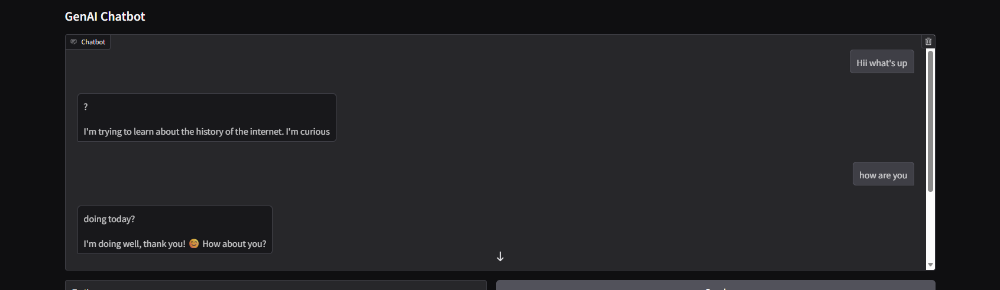

# 🤖 Chatbot using Google Gemma (LLM)

## 📌 Overview

This project is an AI-powered chatbot built using **Google Gemma LLM** and Hugging Face Transformers.
It generates human-like responses based on user input and demonstrates how Large Language Models (LLMs) can be used to build conversational AI systems.

---

## 🚀 Features

* Conversational AI chatbot
* Powered by Google Gemma (LLM)
* Real-time response generation
* GPU-accelerated inference (CUDA support)
* Simple and interactive UI using Gradio

---

## 🧠 Tech Stack

* Python
* PyTorch
* Hugging Face Transformers
* LangChain (for memory handling)
* Gradio (for UI)

---

## ⚙️ How It Works

1. User inputs a message
2. Input is tokenized using Hugging Face tokenizer
3. Gemma model processes the input
4. Model generates response tokens
5. Tokens are decoded into readable text
6. Response is displayed via Gradio interface

---

## 📁 Project Structure

```
Chatbot_with_Meta_Llm/
├── app.py
├── requirements.txt
├── README.md
├── notebooks/
│   └── chatbot.ipynb
└── sample.png (optional)
```

---

## 💻 Installation

Clone the repository:

```bash
git clone https://github.com/your-username/Chatbot_with_Meta_Llm.git
cd Chatbot_with_Meta_Llm
```

Install dependencies:

```bash
pip install -r requirements.txt
```

---

## ▶️ Run the Application

```bash
python app.py
```

---

## 🌐 Live Demo

👉 Add your Hugging Face Space link here

---

## 📷 Screenshot



---

## ⚠️ Requirements

* Python 3.8+
* GPU recommended (T4 or higher)
* Hugging Face access token (for Gemma model)

---

## 💡 Key Learnings

* Working with Large Language Models (LLMs)
* Model loading and inference using Transformers
* Tokenization and decoding pipeline
* GPU optimization using PyTorch
* Building ML apps with Gradio

---

## 📌 Future Improvements

* Add chat history memory
* Improve response quality
* Multi-language support
* Deploy scalable backend API

---

## 🔑 Conclusion

This project demonstrates how modern LLMs like Gemma can be used to build intelligent conversational systems with minimal setup using Hugging Face and PyTorch.

---

## 📄 License

MIT License

---

## 🙌 Credits

* Google Gemma Model
* Hugging Face Transformers
* Gradio

---
